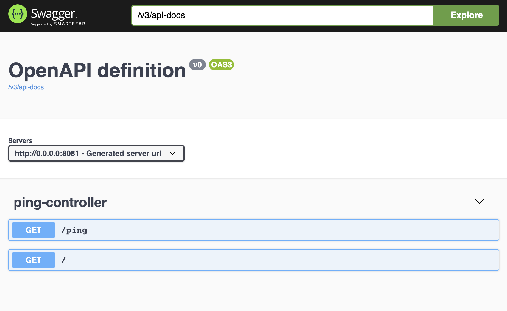

# Api Backend

The CDSC (Custom Driven Supply Chain) is a program aimed at improving logistics processes for inbound, inhouse and outbound. It consist on several tools: Data Integrations, Control Panels, Web applications, Mobile applications

In this repo you can found a basic api, with a mysql and a Swagger documentation where you can try the api methods.

## How to run with Docker 🐳 (recommended)

### Spin up docker container the first time
`$ ./make.sh install`

### Execute the tests
`$ ./make.sh tests`

### Build and run
`$ ./make play`

### Try the api
http://0.0.0.0:8081/swagger-ui/index.html?configUrl=/v3/api-docs/swagger-config#/

### Stop the cointainer
`$ ./make down`

## How to run in local
You need java version 14. and maven installed in your local machine. You can verify the version typing `java -version`

Set up the docker containers, because you need the mysql database running.

### Build
`$ mvnw clean package`

### Run
`$ java -jar target/app*.jar`

### Try the api from local
http://localhost:8080/swagger-ui/index.html?configUrl=/v3/api-docs/swagger-config#/

## To do's

- [ ] Deploy to prod environment 🚀
- [ ] Action when team make a PR (Test, coverage, quality...)
- [ ] How deploy can be modified or improved
- [ ] Monitoring 🤖
- [ ] Secrets 🙊 
- [ ] Infra as code. How to create an RDS (common code, code inside the project...)